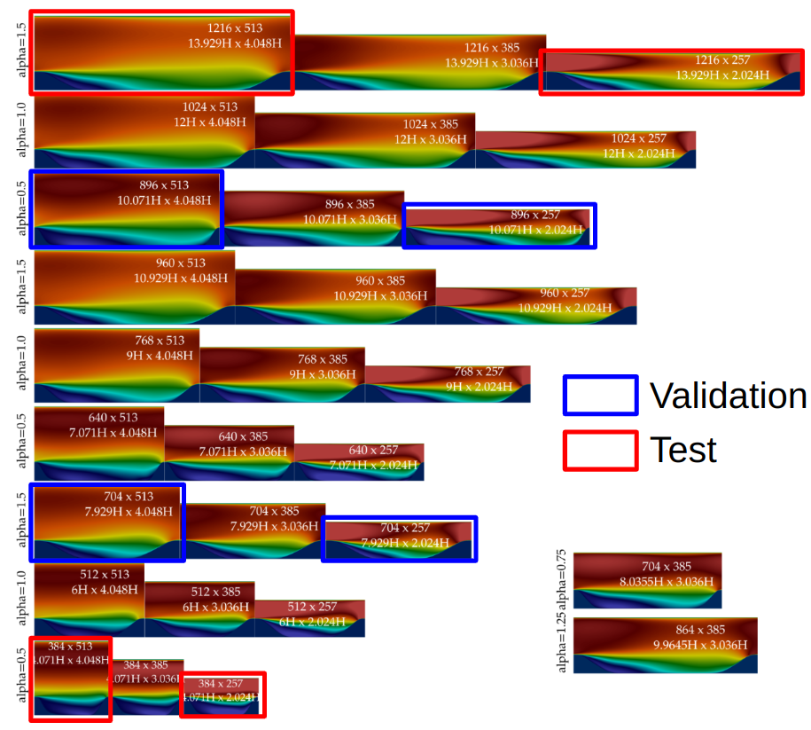

# Benchmark dataset for machine learning in RANS turbulence modelling

The field of ML augmented RANS modelling has seen significant interest for at least a decade. Many methodologies have been proposed. However, a critical problem slowing progress in the field is the absence of an open-source benchmark dataset with clear evaluation criteria. In order to compare a new technique against an existing technique, significant effort is required. We aim to eliminate this required effort and greatly accelerated progress in the field by implementing a benchmark dataset for ML in RANS.

Our goal is to create a challenging dataset that represents the actual state of ML-augmented RANS turbulence modelling. We aim to propose challenging generalization tasks, with the goal that over time, techniques which generalize better will rise to the top of the leaderboard. We do not want to cast the field in an overly optimistic light; we want to provide a hard challenge that will motivate new ideas in the field.

The benchmark task is to **predict the flow field** for a series of test cases given a specified training and validation dataset, as well as a given CFD mesh. All other decisions are left to the submitter.

This is an **ongoing** challenge. It is not associated with any particular conference or event. This running leaderboard aims to summarize the state of the art in the field of ML for RANS turbulence modelling.
## Current status
We've provided all the data here, as well as the train/val/test split so that you may begin preprocessing the data and training your models. However, we're still working on the evaluation script and python package for the challenge. We will have this ready by November 20, 2025. If you have questions or suggestions as this challenge is developed, please open an issue in this repo. This is a community effort!

# Datasets
The following fields are available for each of the datasets:
- RANS predictions with the $k$ - $\omega$ SST model
- DNS or LES "ground truth" data, including **velocity gradients**
## Periodic hills 29 parametric variations
Original data link:
## Periodic hills Re=10595
Original data link:
## Square and rectangular duct
Original data link:
## Curved backward-facing step
Original data link:
## Curved backward-facing step
Original data link:
## NASA Wall-mounted hump  
Original data link:

# Challenge rules
## Input features and fields
You **must** use the **provided** baseline $k$-$\omega$ SST fields to generate your input feature set. This way, we ensure that everyone is using the same baseline fields to make predictions. 

## Training/validation/test split
It is **mandatory** that you use the following training/validation/test split.

This is to ensure fair comparison of all modelling techniques. We are open to adding to this - the below train/val/test split is just what we're starting with for the initial benchmark. A checkmark in the below table indicates cases where only a single parametric variation is available; otherwise, the datasets are split into train/validation/test.

|**Flow**  | **Training** | **Validation** | **Test** |
|- | - | - |  - |
|**PHLL29** | (21 remaining cases)|`alpha_05_10071_4048`, `alpha_05_10071_2024`, `alpha_15_7929_4048`, `alpha_15_7929_2024`| `alpha_15_13929_4048`, `alpha_15_13929_2024`, `alpha_05_4071_4048`, `alpha_05_4071_2024`|
|**DUCT** | `AR_1_Ret_180`,`AR_1_Ret_360`, `AR_3_Ret_180`,`AR_5_Ret_180`, `AR_10_Ret_180` | `AR_7_Ret_180`  |`AR_3_Ret_360`,`AR_14_Ret_180`|
|**CBFS13700** | ✓| | |
|**NASAHUMP**| ✓ | | |
|**PHLL10595**|  | | ✓|

The below figure clarifies the validation/test split chosen for the periodic hills dataset.

The benchmark scores are based on your model's performance on the test datasets.

It is **strictly forbidden** to train on any data from the test cases. The purpose of this benchmark is to provide an honest evaluation and comparison between various ML techniques in turbulence modelling. If you are found to have trained or validated on any of the test cases, your submission will be automatically withdrawn, and a note will be made on the leaderboard.

# Design philosophy
The train/val/test split in the challenge tests the following:
- Reynolds number generalization
- Geometry generalization
- Covariance (model predictions rotate with the entire coordinate frame)
- Galilean invariance (model predictions do not change with a Galilean boost of the input features)

# Submission instructions
You must submit your predictions on the test dataset in **CSV format**.

1. Save your predictions in CSV format under the respective directories in the `test` subdirectory of the benchmark dataset.
2. You can preview what your score will be using the benchmark dataset's python package.
3. Upload your `test` subdirectory to [figshare](https://figshare.com/).
4. Create a pull request for this git repo 
5. The benchmark steward (currently, Ryley McConkey) will evaluate your predictions, and update the leaderboard accordingly.

For more information, please see the YouTube video (in preparation) on how to submit to the leaderboard.

